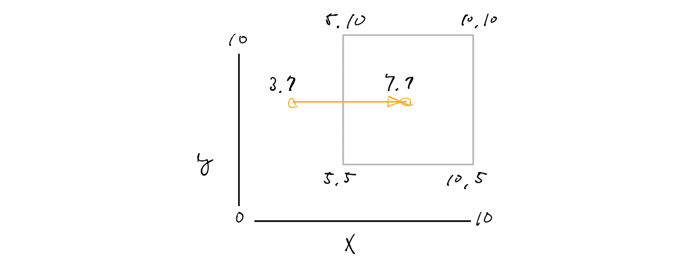

# Geofence example

Detect entry and exit of polygon using GPS log.

## Dependent package

- [golang-geo](https://github.com/kellydunn/golang-geo/)

## Usage
```go
// in
fence := geo.NewPolygon([]*geo.Point{geo.NewPoint(5, 5),
    geo.NewPoint(10, 5),
    geo.NewPoint(10, 10),
    geo.NewPoint(5, 10)})

gpslog := [2]GPSLog{{timestamp: 1494919104.0, longitude: 3, latitude: 7},
	{timestamp: 1494919105.0, longitude: 7, latitude: 7}}

GeoFence(gpslog, fence) // IN
```

image


